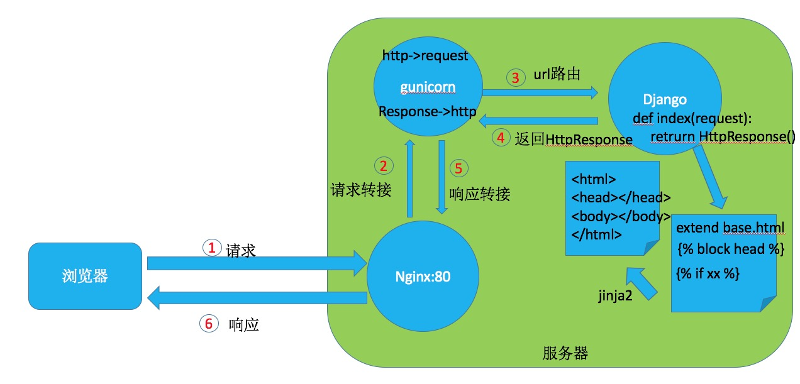
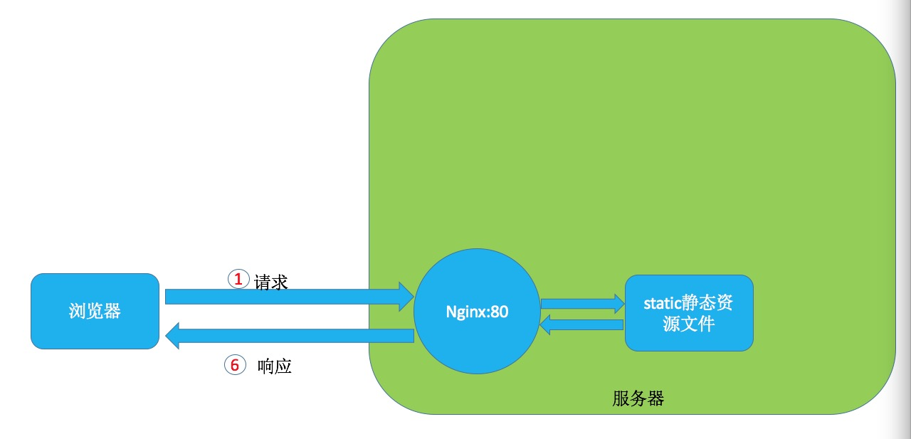

# django_bootstrap分享
## 目录
- 理解web网络请求的数据流方向(django)
- 理解django后端与前端的开发方向与原理
- django_bootstrap 简单demo分享
- 其它 使用review平台与git进行代码团队开发与管理
	- 安装git, arcanist
	- 配置git, arcanist
	- review基本使用

### 理解web网络请求的数据流方向(django)
- 动态资源(需要实现cgi脚本）：如下图
	
</img>
- 静态资源：如下图
	</img>
### 理解django后端与前端的开发方向与原理
- 后端
	- mvc (model与数据库交流 view视图 ctrl(url路由控制))
- 前端
	- html5 展示哪些元素
	- css  如何展示哪些元素
	- javascript ajax 改变元素的各种属性，及响应相应的事件动作.是工作在`浏览器客户端`
	- jquery 用`$('...')`直接获取元素并且操作DOM(由html源码里各 元素，属性，属性值组成的树)
	- bootstrap 直接写好了css,class,id ... 各种元素的属性，直接调用就可以实现旋酷效果。是一个移动设备优先的响应式布局框架
	
- django框架基本操作
	- 优势：`企业级web开发框架，自带用户管理前后端，自带数据ORM(对象映射模型), 类似janja2的模板语言处理`
<pre>
- [source pyenv/bin/activate] # 可以选择用虚拟环境
- pip install django  # 安装
- django-admin startproject plshow  # 创建工程
- cd plshow
- python manage.py startapp intro # 创建项目
- mkdir static; mkdir intro/templates # 创建静态文与模板的文件夹
<pre>
├── intro
│   ├── __init__.py
│   ├── admin.py
│   ├── apps.py
│   ├── migrations
│   │   └── __init__.py
│   ├── models.py
│   ├── templates
│   │   ├── base.html
│   │   ├── foot.html
│   │   ├── head.html
│   │   └── index.html
│   ├── tests.py
│   └── views.py
├── manage.py
├── plshow
│   ├── __init__.py
│   ├── __init__.pyc
│   ├── settings.py
│   ├── settings.pyc
│   ├── urls.py
│   └── wsgi.py
└── static
    ├── css
    ├── images
    └── js
</pre>
- vim plshow/settings.py # 注册项目与配置
- vim urls.py intro/models.py intro/views.py intro/templates/*.html  # 编写mvc各部分
- python manage.py createsuperuser # 创建超级用户,框架自带数据库管理界面
- python manage.py migrate # 创建框架自带的用户模型并同步数据到默认数据库，可在settings.py里配置相应数据库
- python manage.py runserver 0.0.0.0:8000  # 启动框架自带的服务器，可接受浏览器客户端的访问

</pre>

	
### django_bootstrap 简单demo分享
	
- bootstrap 基本介绍
	- [http://www.bootcss.com/](http://www.bootcss.com/)
	- [http://www.runoob.com/bootstrap/bootstrap-tutorial.html](http://www.runoob.com/bootstrap/bootstrap-tutorial.html)
- 实战demo演示
	- git clone [https://github.com/haijunt/plshow](https://github.com/haijunt/plshow)
	
### 其它 使用review平台与git进行代码团队开发与管理
##### 安装git, arcanist
- brew install git
- brew install arcanist
    
    如果报错，请使用如下方式进行安装
    <pre>
    brew uninstall arcanist
    cd /opt
    sudo git clone https://github.com/phacility/libphutil.git
    sudo git clone https://github.com/phacility/arcanist.git

    edit .bashrc or .bash_profile or .zshrc 追回
    export PATH=$PATH:/opt/arcanist/bin/
	</pre>
	
##### 配置git, arcanist
- git config --global user.mail "your@princetechs.com"
- git config --global user.name "yourname"

- 注册用户 http://review.princetechs.com
- arc set-config default http://review.princetechs.com/
- arc install-certificate   #这里需要访问给出的网络地址，并将token粘贴下
- 上传公钥
<pre>
$ ssh-genkey
$ cat .ssh/rsa_key.pub
贴到 http://review.princetechs.com/diffusion/29/  旁边那把钥匙
</pre>

- 克隆远端仓库到本地
    git clone ssh://vcs@review.princetechs.com:2222/diffusion/29/smart_medical.git

- 进行虚拟环境的安装virtualenv
- pip install virtualenv
- virtualenv py2
- source py2/bin/activate #激活虚拟python环境
- pip install ..., 开发。。。
- deactivate # 退出虚拟环境

##### review基本使用
- git status  # 修改代码后可以查看更改了仓库哪些文件
- git add path_file_name   # 将修改的文件同步到本地仓库
- git commit -m'你想说点什么注释'   # 添加注释
- arc diff  # 提交review请求，目前可以设置 reviews的人为 haijunt fengbo,可以去http://review.princetechs.com/tag/smart_medical/ 查看。
- arc land branch(master) # 同意后才能够提交至远程仓库
