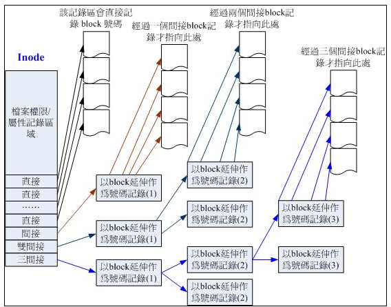

# linux文件系统与命令理论篇

linux使用Ext2文件系统，由boot sector, Superblock, inode bitmap, block bitmap, inode table,block六个部分构成。信息主要有Superblock,inode,block.若要增加日志系统功能，可以使用tune2fs命令快速升级。

 

- superblock信息记录(一般放在第一个block group内，第二个出现就是想备份)
	- block与inode总量
	- 使用量
	- 未使用量
	- block与inode的大小(block 1K,2K,3K, inode 128B关系到最大文件)
	- 文件系统挂载时间与最后写入读取数据时间，检验磁盘时间
	- vilidbit(文件系统是否被挂载)

- File system Description(文件系统描述说明)
	- 每个block group的开始与结束block号码
	- superblock,bitmap,inodemap,data block分别属于哪些block

- bitmap (区块对应表)
	- 记录管理空闲block

- inodemap (inode 对照表)
	- 记录与管理空闲inode

- data block
	- 存放文件内容(每个block可以统一设置为1k,2k,4k,格式化后不能更改。每个block只能放一个文件的内容，可以占用多个)
	
- inodetable(存放文件属性与哪些block内)
	- 文件的访问模式(r/w/x)
	- 文件的所有者与组
	- 文件大小
	- 文件创建或者状态改变的时间(ctime)
	- 文件最后一次读取时间(atime)
	- 文件最近修改时间(mtime)
	- 文件特性的标志(flag),如SetUID等
	- 文件真正内容的指向(pointer)
	- 12个直接指向记录
	- 1个间接指向记录
	- 1个双间接指向记录
	- 1个三间接指向记录
	
 

一般创建文件系统到正常使用，需要经过如下几个部分，分区(fdisk),格式化(mkfs),检验(fsck),挂载(mount),自裁(unmount),及自动挂载(vim /etc/fstab),查看linux系统下支持的文件系统(ls -l /lib/modules/$(uname -r)/kernel/fs)及已经挂载的文件系统(cat /proc/filesystems),linux能够支持这么多的文件系统，只要通过中间层虚拟文件系统。

### 其它
- 目录数的连接数为2(./,../)
- 硬连接
	- ln  源文件 目标文件
	- 在某个目录下新建一条文件名连接到某inode号码的文联记录
	- 不能跨越文件系统
	- 不能连接目录名
	- 就是在block下添加一条记录，通常不会增加inode,block(有可能)
- 软连接(sysmblic link)
	- ln [-fs] 源文件 目标文件
	- 创建一个文件，文件的读取指向它连接的那个文件的文件名(等价于windows里的快捷方式)
	- 会有inode,block
	- 当源文件删除时，会出现打不到源文件的错误