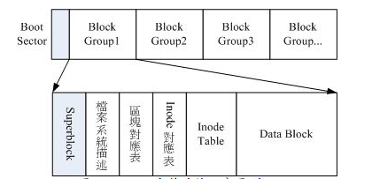

# linux文件系统与命令理论篇

linux使用Ext2文件系统，由Superblock,inode,block三个部分构成。
 

- superblock信息记录(一般放在第一个block group内，第二个出现就是想备份)
	- block与inode总量
	- 使用量
	- 未使用量
	- block与inode的大小(block 1K,2K,3K, inode 128B关系到最大文件)
	- 文件系统挂载时间与最后写入读取数据时间，检验磁盘时间
	- vilidbit(文件系统是否被挂载)

- File system Description(文件系统描述说明)
	- 每个block group的开始与结束block号码
	- superblock,bitmap,inodemap,data block分别属于哪些block

- bitmap (区块对应表)
	- 记录管理空闲block

- inodemap (inode 对照表)
	- 记录与管理空闲inode

- data block
	- 存放文件内容(每个block可以统一设置为1k,2k,4k,格式化后不能更改。每个block只能放一个文件的内容，可以占用多个)
	
- inodetable(存放文件属性与哪些block内)
	- 文件的访问模式(r/w/x)
	- 文件的所有者与组
	- 文件大小
	- 文件创建或者状态改变的时间(ctime)
	- 文件最后一次读取时间(atime)
	- 文件最近修改时间(mtime)
	- 文件特性的标志(flag),如SetUID等
	- 文件真正内容的指向(pointer)
	- 12个直接指向记录
	- 1个间接指向记录
	- 1个双间接指向记录
	- 1个三间接指向记录
	
 